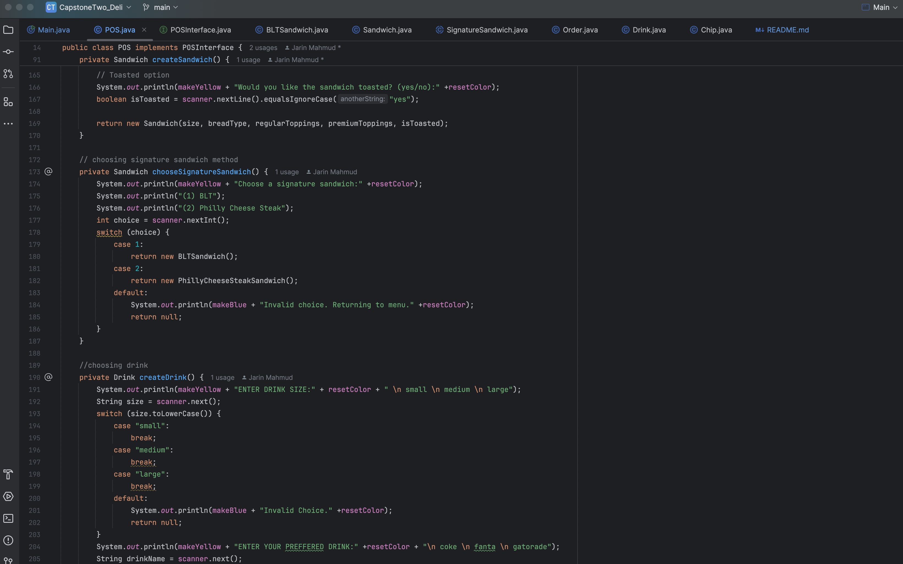

## Capstone Two Delicious

## Purpose:
This project is the point of sales application for DELI-cious, a custom sandwich shop. 
This CLI version of POS will do the basic automation of the sandwich shop allowing customizing sandwiches and orders.

## Demo Class Diagram:

## Planning chart:
The project code will follow the outline attached below:

| External Files and Folders                                | Class to Run POS | POS for operation | Menu for prices and details                                                    | GUI                |
|-----------------------------------------------------------|------------------|-------------------|--------------------------------------------------------------------------------|--------------------|
| README.MD                                                 | Main.java        | POS.java          | Order.java                                                                     | WelcomeWindow.java |
| receipts folder (containing order receipts as .txt files) |                  | POSInterface.java | Drink.java  Chips.java Sandwich.java                                   |                    |
|                                                           |                  |                   | SignatureSandwich.java BLTSandwich.java PhillyCheeseSteakSandwich.java |                    |

## Project Chart:

## Understanding Class Functions:
Main.java: Main class to call methods.  
POS.java: contains methods for operation for POS. POS implements POSInterface.  
POSInterface.java: Interface for uniform actions on POS.  
Order.java: contains variables, constructor, calculate price method and to string for order.  
Drink.java: contains variables, constructor, calculate price method and to string for drink.  
Chips.java: contains variables, constructor, calculate price method and to string for chips.  
Sandwich.java: contains variables, constructor, calculate price method and to string for sanwiches.  
SignatureSandwich.java: contains common details of signature sandwiches.  
BLTSandwich.java: contains details of BLT sandwich.  
PhillyCheeseSteakSandwich.java: contains details of Philly CheeseSteak Sandwich.  
WelcomeWindow.java: contains GUI method to display logo in welcome window.  
Readme.md: Contains project details. 
Receipts: Folder for storing receipts

## Code Snippets:

### Main.java:

### POS.java:

### POSInterface.java: 

### Order.java: 

### Drink.java: 

### Chips.java: 

### Sandwich.java: 

### SignatureSandwich.java: 

### BLTSandwich.java: 

### PhillyCheeseSteakSandwich.java: 

### WelcomeWindow.java:

### Receipts: 

## Sample Input and Output:

### Error/Invalid Choice Snippet:
Any error or choice outside of case shows Invalid Choice.

### Interesting Piece of Code:

### Limitations:
1. Invalid Inputs of adding another sandwich, drink and chips should be shown as error.
2. Signature Sandwiches should be able to be customized.

### Future Upgrade:
1. Memory Optimization.
2. Better looking GUI for customers.
3. Customer Profile.
4. Order history by profile.
5. Quick order.

Project done by JARIN MAHMUD.

### ***End of Readme***